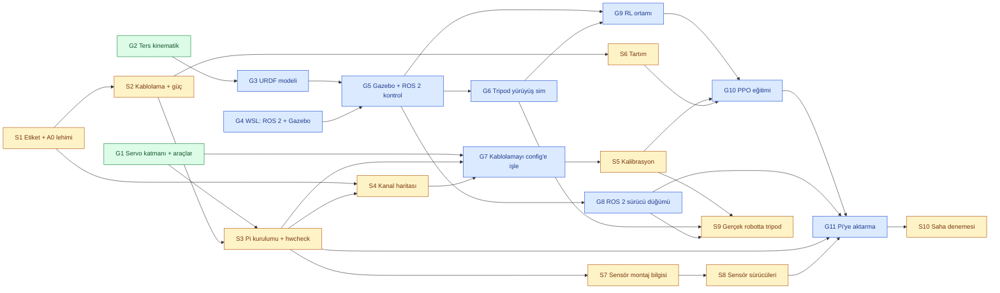

# Görev Dağılımı

İki kişi, iki hat:

- **Görkem** — yazılım ve simülasyon (Claude ile). Robotu kendisi kurmadı; donanım işi almaz.
- **Samet** — robotun başında yapılan her şey: kablolama, Pi kurulumu, kalibrasyon, tartım, sensörler, gerçek robotta denemeler.

> [!NOTE]
> Samet'in donanım tarafını üstlendiği varsayıldı (robotu kuran kişi olarak). Değilse görevlerin
> sahibini bu dosyada değiştirin; bağımlılıklar aynı kalır.

Proje bağlamı: [docs/PROJE_DEVIR.md](docs/PROJE_DEVIR.md). Kurulum ve araçlar: [README.md](README.md).

## Nasıl okunur

- **Kimlik:** `G3` Görkem'in 3. görevi, `S5` Samet'in 5. görevi. Commit mesajlarında ve konuşurken bu kimlikler kullanılır.
- **Bekler:** başlamadan önce bitmiş olması gereken görevler. Bunlar bitmeden başlanırsa iş ya yapılamaz ya da tekrar yapılır.
- **Açar:** bu görev bitince başlayabilecek görevler.
- **Bitti sayılır:** görevin kapanma şartı. Şart sağlanmadan ✅ konmaz.
- **Durum:** ✅ bitti · 🔄 sürüyor · ⬜ başlayabilir · ⏸ bekliyor (bir bağımlılık bitmedi)

Bir görevi bitiren kişi: durumunu ✅ yapar, "Açar" satırındaki görevlerin sahiplerine haber verir.

## Bağımlılık grafiği

Mavi Görkem'in, sarı Samet'in, yeşil bitmiş görevler. Oklar "önce bu biter, sonra şu başlar" demek.

## Özet

| Kimlik | Görev | Sahip | Bekler | Açar | Durum |
|---|---|---|---|---|---|
| G1 | Servo sürücü katmanı, kalibrasyon ve kanal haritası araçları | Görkem | — | G7, S3 | ✅ |
| G2 | Ters/düz kinematik + gövde pozu | Görkem | — | G3 | ✅ |
| G3 | URDF modeli | Görkem | G2 | G5 | 🔄 |
| G4 | WSL'e ROS 2 Lyrical + Gazebo Jetty kurulumu | Görkem | — | G5 | ⬜ |
| G5 | Gazebo dünyası + ROS 2 kontrol arayüzü + sanal sensörler | Görkem | G3, G4 | G6, G8, G9 | ⏸ |
| G6 | Tripod yürüyüş, simülasyonda | Görkem | G5 | G9, S9 | ⏸ |
| G7 | Kablolama sonuçlarını `robot.yaml`'a işle | Görkem | S3, S4 | S5 | ⏸ |
| G8 | ROS 2 sürücü düğümü (gerçek servolar) | Görkem | G5 | S9, G11 | ⏸ |
| G9 | RL ortamı (Gymnasium) | Görkem | G5, G6 | G10 | ⏸ |
| G10 | PPO eğitimi + alan rastgeleleştirme | Görkem | G9, S5, S6 | G11 | ⏸ |
| G11 | Pi 4'e aktarma: politika + düğümler | Görkem | G10, G8, S3, S8 | S10 | ⏸ |
| S1 | "ÖN" bandı + bacak numaraları + A0 lehimi | Samet | — | S2, S4 | ⬜ |
| S2 | Kablolama ve güç hattı | Samet | S1 | S3, S6 | ⏸ |
| S3 | Pi kurulumu + `hwcheck.py` | Samet | S2 | S4, S7, G7, G11 | ⏸ |
| S4 | Kanal haritası (`map_channels.py`) | Samet | S1, S3 | G7 | ⏸ |
| S5 | 18 eklemin kalibrasyonu (`calibrate.py`) | Samet | G7 | G10, S9 | ⏸ |
| S6 | Tartım ve elektronik envanteri | Samet | S2 | G10 | ⏸ |
| S7 | Sensör montaj bilgisi (IMU, 3× VL53L0X) | Samet | S3 | S8 | ⏸ |
| S8 | Sensör sürücüleri (saf Python, testli) | Samet | S7 | G11 | ⏸ |
| S9 | Gerçek robotta tripod yürüyüş | Samet | S5, G6, G8 | — | ⏸ |
| S10 | Saha denemesi: farklı zeminler | Samet | G11 | — | ⏸ |

**Şu an başlanabilecekler:** Görkem → G3 (sürüyor), G4. Samet → S1.

**Kritik kesişmeler:** iki hat üç yerde birbirini bekler.
1. **S4 → G7 → S5:** kalibrasyon aracı kablolama `robot.yaml`'a girilmeden başlamaz. Samet kanal haritasını çıkarır, Görkem config'e işler, Samet kalibrasyona geçer. Aradaki iş küçük; beklemeyi kısa tutmak için S4 bitince hemen haber verin.
2. **S5 + S6 → G10:** RL eğitimi gerçek eklem limitleri ve gerçek kütle olmadan yapılırsa politika simülasyonda robotun gerçekte yapamayacağı hareketleri öğrenir. Şu an simülasyon geçici ±90° limit ve CAD'den 2,13 kg kütle tahmini kullanıyor.
3. **S3 + S8 → G11:** politika Pi'ye ancak Pi hazır ve gerçek sensörler okunabiliyorken aktarılır.

## Görkem'in görevleri

### G1 — Servo sürücü katmanı ve araçlar ✅
`hexapod_driver` paketi; `calibrate.py`, `map_channels.py`, `hwcheck.py`, `cad_extract.py`. 56 test.

### G2 — Ters kinematik ✅
`hexapod_kinematics`: tek bacak IK/FK, altı bacak, gövde pozu. IK ↔ kalibrasyon sözleşmesi [CLAUDE.md](CLAUDE.md)'de.

### G3 — URDF modeli 🔄
- **Bekler:** G2 · **Açar:** G5
- Bitenler: CAD'den kütle/atalet/çarpışma verisi (`tools/cad_sim_model.py`, `robot.yaml` → `simulation`), veri katmanı (`hexapod_description.model`).
- Kalan: `robot.yaml`'dan URDF üreten modül; görsel mesh'ler (`meshes.yaml`); RViz'de görüntüleme.
- **Bitti sayılır:** URDF'ten hesaplanan ayak konumları `hexapod_kinematics.forward` ile aynı (test); `check_urdf` hatasız; RViz'de robot doğru görünüyor.

### G4 — WSL'e ROS 2 + Gazebo kurulumu ⬜
- **Bekler:** — · **Açar:** G5
- Ubuntu 26.04 (WSL2) üzerine ROS 2 Lyrical + Gazebo Jetty (`ros-lyrical-desktop`). Kurulum komutları tek tek verilecek; `sudo` şifresini Görkem kendisi girer.
- **Bitti sayılır:** `gz sim` açılıyor; `ros2 run demo_nodes_cpp talker` çalışıyor.

### G5 — Gazebo dünyası + ROS 2 kontrol ⏸
- **Bekler:** G3, G4 · **Açar:** G6, G8, G9
- Robot düz zeminde doğar; 18 eklem pozisyon kontrollü (`gz_ros2_control`); IMU ve ayak temas sensörleri ROS 2 konularına yayınlanır. Bu arayüz, G8'deki gerçek sürücüyle aynı olacak şekilde tasarlanır.
- **Bitti sayılır:** bir komutla robot simülasyonda ayağa kalkıp duruyor; IMU ve temas verisi `ros2 topic echo` ile görülüyor.

### G6 — Tripod yürüyüş (simülasyon) ⏸
- **Bekler:** G5 · **Açar:** G9, S9
- `hexapod_gait` paketi, IK üzerinden. RL için hem karşılaştırma ölçütü hem yedek.
- **Bitti sayılır:** simülasyonda düz zeminde devrilmeden en az 1 dakika ileri yürüyor; hız ve adım parametreleri config'den.

### G7 — Kablolamayı `robot.yaml`'a işle ⏸
- **Bekler:** S3 (kart adresleri), S4 (kanal haritası) · **Açar:** S5
- `map_channels.py` bacakları fiziksel bant numarasıyla (1–6) veriyor; bunlar `robot.yaml`'daki bacak kimliklerine çevrilip `joints[*].driver/channel` ve `drivers[*].address` doldurulur. Eşleme tablosu: PROJE_DEVIR §5.5.
- **Bitti sayılır:** `python tools/hwcheck.py` ve `calibrate.py --dry-run` kablolama eksiği bildirmiyor; commit atıldı.

### G8 — ROS 2 sürücü düğümü ⏸
- **Bekler:** G5 · **Açar:** S9, G11
- `hexapod_driver`'ın ROS 2 sarmalayıcısı: eklem komutlarını `ServoBus.set_angle`'a taşır. Çekirdek saf Python kalır. `--dry-run` ile robotsuz yazılır ve test edilir.
- **Bitti sayılır:** simülasyonla aynı komut arayüzü; dry-run'da 18 eklem doğru kanala doğru darbeyi yazıyor (test).

### G9 — RL ortamı ⏸
- **Bekler:** G5, G6 · **Açar:** G10
- Gymnasium ortamı, ros_gz üzerinden. Gözlem: IMU + eklem açıları + ayak temasları. Eylem: eklem hedefleri ya da tripod parametre düzeltmeleri. Ödül: ileri hız − enerji − devrilme cezası (TÜBİTAK başvurusundaki tanım).
- **Bitti sayılır:** rastgele politikayla bir bölüm uçtan uca koşuyor; tripod yürüyüşün ödülü ölçülüp kaydedildi.

### G10 — PPO eğitimi ⏸
- **Bekler:** G9, S5 (gerçek limitler), S6 (gerçek kütle) · **Açar:** G11
- Stable-Baselines3 PPO. Alan rastgeleleştirme: zemin, sürtünme, kütle, itme, gecikme. Senaryolar hangi zorlukları kapsarsa politika onları çözer.
- **Bitti sayılır:** eğitilmiş politika simülasyonda tripod yürüyüşünü ödülde geçiyor; eğim, engebe ve kaygan zeminde ayrı ayrı ölçüldü.

### G11 — Pi 4'e aktarma ⏸
- **Bekler:** G10, G8, S3, S8 · **Açar:** S10
- Politika + ROS 2 düğümleri Pi'de; gerçek IMU ve servolarla kapalı döngü.
- **Bitti sayılır:** politika Pi'de gerçek zamanlı çalışıyor, robot düz zeminde yürüyor.

## Samet'in görevleri

> Kablo ve güç işlerinde güvenlik notları: [docs/PROJE_DEVIR.md](docs/PROJE_DEVIR.md) §4.4. Özellikle: PCA9685'in VCC'si Pi'nin **3.3 V**'una (pin 1), 5 V'a değil. Servolar voltaj düşürücüden **~6 V** ile beslenir (dolu 2S LiPo 8.4 V verir, MG996R en fazla 7.2 V kaldırır).

### S1 — Etiketleme ve A0 lehimi ⬜
- **Bekler:** — · **Açar:** S2, S4
- İki bacak arasına "ÖN" bandı; yukarıdan bakınca saat yönünde bacaklara 1–6 (1 sol ön, 2 sağ ön, 3 sağ orta, 4 sağ arka, 5 sol arka, 6 sol orta). Hangi tarafın ön olduğu fark etmez, robot simetrik.
- İki PCA9685'ten birinin **A0** lehim noktasını birleştir (adresi 0x40'tan 0x41'e geçer; ikisi aynı adreste kalırsa kanal haritası yanlış çıkar).
- **Bitti sayılır:** bantlar yapıştırıldı, bir kartın A0'ı lehimli; fotoğrafı paylaşıldı.

### S2 — Kablolama ve güç hattı ⏸
- **Bekler:** S1 · **Açar:** S3, S6
- PCA9685 → Pi: VCC→pin 1 (3.3 V), SDA→pin 3, SCL→pin 5, GND→pin 6. Servolar kartlara, sıra fark etmez.
- Servo beslemesi buck'tan; **bağlamadan önce** çıkışı multimetreyle ~6 V'a ayarla. Pi ayrı beslemeden (5 V USB regülatör). Topraklar ortak. Sigorta nerede, not et.
- **Bitti sayılır:** her şey bağlı; buck çıkışı ölçüldü ve değeri yazıldı; servo ve Pi beslemesinin ayrı, toprağın ortak olduğu kontrol edildi.

### S3 — Pi kurulumu ⏸
- **Bekler:** S2 · **Açar:** S4, S7, G7, G11
- Ubuntu Server 26.04 arm64; depoyu `git clone`; I2C açık mı (`ls /dev/i2c-1`), kullanıcı `i2c` grubunda mı (`sudo usermod -aG i2c $USER`).
- `python3 tools/hwcheck.py` çalıştır, çıktısını Görkem'e ilet.
- **Bitti sayılır:** `hwcheck.py` iki PCA9685'i (0x40, 0x41) ve IMU'yu görüyor; çıktı paylaşıldı.

### S4 — Kanal haritası ⏸
- **Bekler:** S1, S3 · **Açar:** G7
- Robot kutunun üstünde, bacaklar havada (servo ilk sinyalde orta konuma zıplar). `python3 tools/map_channels.py`: araç her kanaldaki servoyu kıpırdatır, hangi bacağın hangi eklemi olduğunu yazarsın (`1c` = bacak 1 coxa, `3f` femur, `6t` tibia).
- **Bitti sayılır:** 18 eklemin tamamı eşlendi; aracın bastığı harita Görkem'e iletildi.

### S5 — Kalibrasyon ⏸
- **Bekler:** G7 · **Açar:** G10, S9
- `python3 tools/calibrate.py`; her eklem için sırayla: `c` (merkez = sıfır duruşu) → `dir` → `span` → `limit min` / `limit max`. Sıfır duruşu ve yönlerin tanımı aracın yardım metninde (`?`) ve [CLAUDE.md](CLAUDE.md)'de. Aynı anda tek servo beslenir.
- **Bitti sayılır:** `config/calibration.yaml` 18 eklem için dolu ve commit'lendi; `limits` çıktısı `robot.yaml`'a işlendi.

### S6 — Tartım ve elektronik envanteri ⏸
- **Bekler:** S2 · **Açar:** G10
- Robotu tart (bataryalar takılı, yürüyeceği hâliyle). Robotun üstünde kaç batarya, kaç buck var; gövde kapağı takılı mı; Pi, kartlar ve batarya nerede duruyor.
- **Bitti sayılır:** `robot.yaml` → `body.total_mass_kg` gerçek değerle, `measured: true`; elektronik listesi PROJE_DEVIR'e ya da bir issue'ya yazıldı. (Simülasyon şu an 2,13 kg tahminle çalışıyor.)

### S7 — Sensör montaj bilgisi ⏸
- **Bekler:** S3 · **Açar:** S8
- IMU (BNO055) nerede ve hangi yöne bakıyor; I2C adresi (0x28 ya da 0x29). Üç VL53L0X'in her birinin XSHUT'u hangi GPIO'ya bağlı, hangi yöne bakıyor.
- **Bitti sayılır:** `robot.yaml` → `sensors` bölümündeki boş alanlar dolu.

### S8 — Sensör sürücüleri ⏸
- **Bekler:** S7 · **Açar:** G11
- `hexapod_driver` ile aynı desende saf Python: VL53L0X'leri XSHUT ile sırayla uyandırıp yeniden adresleme (üçü de 0x29'da doğar; BNO055 de 0x29'da olabilir, çakışmaya dikkat), BNO055 okuma. Donanımsız testler için DryRunBackend.
- **Bitti sayılır:** üç mesafe sensörü ve IMU aynı anda okunuyor; testler robotsuz geçiyor.

### S9 — Gerçek robotta tripod ⏸
- **Bekler:** S5, G6, G8 · **Açar:** —
- Önce robot havadayken, sonra yerde. Simülasyondan farkları not et: ayak sapması, servo ısınması, besleme çökmesi (Pi resetlenirse brownout'tur, yazılım hatası değil).
- **Bitti sayılır:** robot düz zeminde yürüyor; farklar raporlandı. Bu rapor G10'daki rastgeleleştirme aralıklarını belirlemeye yarar.

### S10 — Saha denemesi ⏸
- **Bekler:** G11 · **Açar:** —
- TÜBİTAK planındaki "simülasyondaki en iyi sonuçlarla gerçek arazide deneme": eğim, engebe, kum, kaygan zemin. Video ve ölçüm (hız, devrilme sayısı).
- **Bitti sayılır:** her zemin için kayıt ve kısa rapor.
