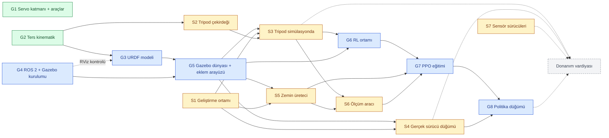
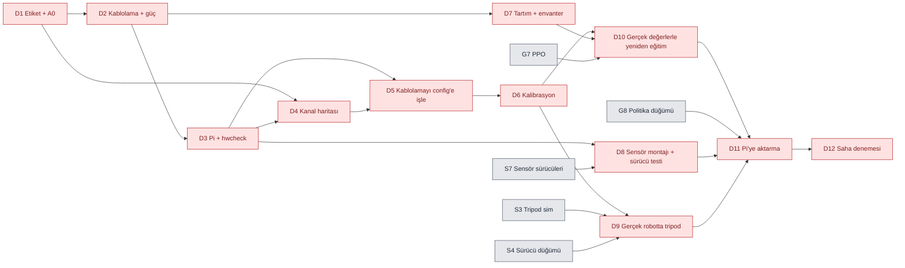

# Görev Dağılımı

İş iki bölüm:

1. **Yazılım aşaması — ŞİMDİ.** Görkem ve Samet'e bölüşüldü. Her şey CAD geometrisiyle simülasyonda ilerler; robota dokunulmaz.
2. **Donanım vardiyası — ⏸ DURDURULDU.** Kablolama, kalibrasyon, tartım ve gerçek robotta denemeler. Yazılım aşaması belli bir noktaya gelince ayrı bir vardiya olarak topluca yapılır (başlama şartı [aşağıda](#donanım-vardiyası--durduruldu)).

Proje bağlamı: [docs/PROJE_DEVIR.md](docs/PROJE_DEVIR.md). Kurulum ve araçlar: [README.md](README.md).

> [!NOTE]
> 2026-09-24'te yeniden düzenlendi. İlk dağılımdaki (commit `a2348a7`) numaralar geçersiz: o planda Samet donanıma ayrılmıştı, artık yazılım görevleri alıyor.

## Nasıl okunur

- **Kimlik:** `G` Görkem'in, `S` Samet'in yazılım görevleri; `D` donanım vardiyası. Örnek: `S3` Samet'in 3. görevi. Commit mesajlarında ve konuşurken bu kimlikler kullanılır.
- **Bekler:** başlamadan önce bitmiş olması gereken görevler. Bunlar bitmeden başlanırsa iş ya yapılamaz ya da tekrar yapılır.
- **Açar:** bu görev bitince başlayabilecek görevler.
- **Bitti sayılır:** görevin kapanma şartı. Şart sağlanmadan ✅ konmaz.
- **Durum:** ✅ bitti · 🔄 sürüyor · ⬜ başlayabilir · ⏸ bekliyor (bir bağımlılık bitmedi ya da durduruldu)

Bir görevi bitiren kişi durumunu ✅ yapar ve "Açar" satırındaki görevlerin sahiplerine haber verir.

---

## Yazılım aşaması (şimdi)

### Bağımlılık grafiği

Mavi Görkem'in, sarı Samet'in, yeşil bitmiş görevler. Oklar "önce bu biter, sonra şu başlar" demek. Gri kesikli kutu durdurulmuş donanım vardiyası.

### Özet

| Kimlik | Görev | Sahip | Bekler | Açar | Durum |
|---|---|---|---|---|---|
| G1 | Servo sürücü katmanı, kalibrasyon ve kanal haritası araçları | Görkem | — | (vardiya) | ✅ |
| G2 | Ters/düz kinematik + gövde pozu | Görkem | — | G3, S2 | ✅ |
| G3 | URDF modeli | Görkem | G2 (son kontrol: G4) | G5 | ✅ |
| G4 | ROS 2 Lyrical + Gazebo kurulumu (Görkem'in PC'si) | Görkem | — | G3, G5 | ✅ |
| G5 | Gazebo dünyası + eklem komut arayüzü + sanal sensörler | Görkem | G3, G4 | S3, S4, S5, G6 | ✅ |
| G6 | RL ortamı (Gymnasium) | Görkem | G5, S3 | G7 | 🔄 |
| G7 | PPO eğitimi + alan rastgeleleştirme | Görkem | G6, S5, S6 | G8 | ⏸ |
| G8 | Politika çalıştırma düğümü (ROS 2) | Görkem | G7, S4 | (vardiya) | ⏸ |
| S1 | Geliştirme ortamı (ROS 2 + Gazebo, depo, testler) | Samet | — | S3, S4, S5 | ⬜ |
| S2 | Tripod yürüyüş çekirdeği (saf Python) | Samet | G2 ✅ | S3 | ⬜ |
| S3 | Tripod yürüyüş simülasyonda | Samet | S1, S2, G5 | G6, S6, (vardiya) | ⏸ |
| S4 | Gerçek robot sürücü düğümü (ROS 2, dry-run) | Samet | S1, G5 | G8, (vardiya) | ⏸ |
| S5 | Zemin / dünya üreteci | Samet | S1, G5 | G7, S6 | ⏸ |
| S6 | Yürüyüş ölçüm aracı (hız, enerji, devrilme) | Samet | S3, S5 | G7 | ⏸ |
| S7 | Sensör sürücüleri (saf Python, dry-run testli) | Samet | — | (vardiya) | ⬜ |

**Şu an başlanabilecekler:**
- **Görkem:** G6'nın tripod'a bağlı olmayan kısmı (simülasyon hızı, ortam iskeleti; bkz. G6). Tripod'u kullanan kısım S3'ü bekler.
- **Samet:** S1, S2, S7. Üçü de Görkem'i beklemiyor. S2 ile S7 ROS bile gerektirmiyor.
- **G5 bitti, simülasyon çalışıyor:** Samet'in S3, S4 ve S5'i artık Görkem'i beklemiyor. Arayüz: [docs/ARAYUZ.md](docs/ARAYUZ.md). Derleme: `bash tools/wsl/derle.sh`.

**İki kişinin birbirini beklediği yerler:**
1. **G5 → S3, S4, S5:** Samet'in simülasyon işleri Görkem'in Gazebo dünyasını ve eklem komut arayüzünü bekler. Samet o sırada S2 (tripod çekirdeği) ve S7 (sensör sürücüleri) ile meşgul olur, boşta kalmaz.
2. **S3 → G6:** RL ortamı, tripod yürüyüşü hem karşılaştırma ölçütü hem de RL'in üstüne öğreneceği temel olarak kullanır.
3. **S5 + S6 → G7:** PPO eğitimi, Samet'in ürettiği zeminlerde yapılır ve Samet'in ölçüm aracıyla değerlendirilir.
4. **S4 → G8:** politika düğümü, gerçek sürücüyle aynı arayüzü konuşmalı ki simülasyondan robota geçişte kod değişmesin.

### Görkem'in görevleri

#### G1 — Servo sürücü katmanı ve araçlar ✅
`hexapod_driver` paketi; `calibrate.py`, `map_channels.py`, `hwcheck.py`, `cad_extract.py`.

#### G2 — Ters kinematik ✅
`hexapod_kinematics`: tek bacak IK/FK, altı bacak, gövde pozu. IK ↔ kalibrasyon sözleşmesi [CLAUDE.md](CLAUDE.md)'de.

#### G3 — URDF modeli ✅
- **Bekler:** G2; son kontrol (RViz, `check_urdf`) için G4 · **Açar:** G5
- Bitenler:
  - CAD'den kütle/atalet/çarpışma verisi (`tools/cad_sim_model.py`, `robot.yaml` → `simulation`).
  - URDF üreticisi (`hexapod_description.urdf`, `python tools/make_urdf.py`); görsel mesh'ler `meshes.yaml`'dan.
  - Test: URDF zincirindeki ayak konumları IK ile 300 rastgele pozda aynı; eksen yönleri kalibrasyon sözleşmesiyle uyumlu (`tests/test_urdf.py`).
  - ROS'suz önizleme (`python tools/preview_urdf.py`): parçalar eklemlerde doğru oturuyor.
  - `check_urdf` hatasız; robot_state_publisher'ın TF'i IK ile aynı (bacak 0 ayağı (0, 0.230, −0.137) m, bacak 2 (0.199, −0.115, −0.137) m).
  - RViz: `ros2 launch hexapod_description display.launch.py` hatasız açılıyor, mesh'ler yükleniyor. WSLg'de RViz Wayland'de çöküyordu ("Invalid parentWindowHandle"); launch dosyası Wayland varsa `QT_QPA_PLATFORM=xcb` veriyor.
- **Bitti sayılır:** RViz'de robot doğru görünüyor, eklem kaydırıcıları bacakları doğru yönde oynatıyor; `check_urdf` hatasız.

#### G4 — ROS 2 + Gazebo kurulumu ✅
- **Bekler:** — · **Açar:** G3, G5
- WSL2 Ubuntu 26.04'e ROS 2 Lyrical + Gazebo. Hepsini tek betik yapar: WSL terminalinde depo klasöründen `bash tools/wsl/ros_kurulum.sh`. `sudo` şifresini betik bir kez sorar, Görkem kendisi girer.
- **Bitti sayılır:** betik "KURULUM TAMAM" diyor; `gz sim shapes.sdf` pencere açıyor.
- Sonuç: ROS 2 Lyrical, Gazebo 10.5 (Jetty), Python 3.14. Paketler `bash tools/wsl/derle.sh` ile `~/hexapod_ws`'te derleniyor.

#### G5 — Gazebo dünyası + eklem komut arayüzü ✅
- **Bekler:** G3, G4 · **Açar:** S3, S4, S5, G6
- Bitenler (ROS'suz yazılabilen her şey, 15 test):
  - Arayüz: `hexapod_description.interface` + [docs/ARAYUZ.md](docs/ARAYUZ.md). `/leg_controller/commands` (Float64MultiArray, 18 değer, radyan), `/joint_states`, `/imu`, `/leg{i}/foot_contact` (yalnız sim).
  - URDF'e Gazebo ekleri: ros2_control (konum komutu), gz_ros2_control eklentisi (kazanç servo tepki süresinden), IMU ve altı ayak temas sensörü.
  - Kontrolcü ayarı üretici (`hexapod_description.control`; ForwardCommandController).
  - `hexapod_gazebo` paketi: `worlds/flat.sdf`, `launch/sim.launch.py`, `ros2 run hexapod_gazebo stand` (ayağa kalkma duruşu).
- Gazebo'da doğrulandı (`sim.launch.py gui:=false`):
  - İki kontrolcü açık; bütün konular (/imu, /joint_states, 6 temas, komut) yayında.
  - Doğunca sıfır duruşunda gövde 0.1366 m (= tibia + 10.05 mm, ayaklar yerde).
  - `ros2 run hexapod_gazebo stand` sonrası gövde 0.1001 m (istenen 100 mm), yatıklık yok.
  - IMU `imu_link` çerçevesinde, z ivmesi 9.8. Temas sensörleri SDF'teki ayak küresine bağlı.
  - Konum limiti (±90°) ve hız limiti (7.48 rad/s) ros2_control tarafından uygulanıyor.
  - Gazebo penceresi WSLg'de açılıyor.
- Robot düz zeminde doğar; 18 eklem pozisyon kontrollü (`gz_ros2_control`); IMU ve ayak temas sensörleri ROS 2 konularına yayınlanır.
- **Eklem komut arayüzünü bu görev tanımlar:** hangi konu, hangi mesaj, hangi sıra, hangi birim. Samet'in tripod'u (S3), gerçek sürücüsü (S4) ve Görkem'in politika düğümü (G8) aynı arayüzü konuşur; simülasyondan robota geçişte yalnızca karşı taraf değişir. Arayüz bir belge olarak yazılır ve Samet'le birlikte gözden geçirilir.
- **Bitti sayılır:** tek komutla robot simülasyonda doğup duruyor; eklemler arayüzden komut alıyor; IMU ve temas verisi `ros2 topic echo` ile görülüyor; arayüz belgesi depoda.

#### G6 — RL ortamı 🔄
- **Bekler:** G5 ✅, S3 · **Açar:** G7
- Bitenler: `hexapod_rl.sim.HexapodSim` — ROS'suz, süreç içi Gazebo (gz.sim). Aynı URDF, aynı fizik, ros2_control ile aynı servo modeli. Tek süreç 2 ms adımda gerçek zamanın 4.5 katı, 8 paralel süreç toplam ~21 katı (50 Hz'de 1 milyon adım ~16 dk). Testli (Linux'ta 6 Gazebo testi: ayakta duruş, 100 mm'ye kalkış, sıfırlama, aynı komut = aynı sonuç, limit kırpma).
- Bitenler (2): `hexapod_rl.env.HexapodEnv` (Gymnasium) — gözlem yalnız gerçek robotta da olanlar (IMU, son komutlar, hız komutu, adım saati), eylem ayakta duruş + düzeltme, ödül TÜBİTAK tanımına göre (`hexapod_rl.task`). SB3'ün `check_env` denetiminden geçiyor. `python -m hexapod_rl.train` ile 8 paralel ortamda PPO: ~500 adım/s (gerçek zamanın ~10 katı). Kurulum: `bash tools/wsl/rl_kurulum.sh` (venv; torch CPU, SB3, Gymnasium).
- Kalan: tripod'u (S3) aynı ortamda ölçüp kaydetmek ("bitti" şartı); tripod'a dayanan eylem modu (S3'ün üstüne düzeltme).
- **Önemli düzeltme (2026-09-25):** RL simülasyonunun servo modeli tork tabanlı oldu. Eski (hız komutlu) modelde elle yazılmış tripod bile beklenen hızın %12'siyle yürüyordu; yeni modelde aynı katalog torkunda %94–97. **Samet için (S2/S3): tripod'unu `hexapod_rl.sim` ile de dene; ROS'lu simülasyon (sim.launch.py) hâlâ eski servo modelini kullanıyor, orada ayaklar kayar.**
- **Hız ölçümü (G5 sonrası), tasarımı belirliyor:** tam simülasyon (ROS + ros2_control + sensörler + köprü) sınırsız modda bile gerçek zamanın ~1.3 katı; 50 Hz'de 1 milyon adım ~4 saat. ROS'suz yalın Gazebo ~3–5 kat. `gz.sim` Python bağları kurulu (Python 3.14). Öneri: eğitim ortamı ROS'u aradan çıkarıp Gazebo'yu süreç içinden adımlasın, 8 çekirdekte paralel ortam; ROS arayüzü (docs/ARAYUZ.md) yalnız politika düğümünde (G8) kalır. Başka simülatöre geçmek TÜBİTAK başvurusundan sapma olur, önerilmiyor.
- Gymnasium ortamı, ros_gz üzerinden. Gözlem: IMU + eklem açıları + ayak temasları. Eylem: eklem hedefleri ya da tripod parametre düzeltmeleri (S3'ün üstüne). Ödül: ileri hız − enerji − devrilme cezası (TÜBİTAK başvurusundaki tanım).
- **Bitti sayılır:** rastgele politikayla bir bölüm uçtan uca koşuyor; tripod'un ödülü aynı ortamda ölçülüp kaydedildi.

#### G7 — PPO eğitimi ⏸
- **İlk deneme (G6 duman testi, 2026-09-24):** 1M adım, 8 ortam, 34 dk. Ödül ~550'den ~810'a çıktı ama değerlendirmede robot yerinde durdu (vx 0.1 m/s istendi, 10 s'de -1.5 cm), devrilmedi. Yorum: ödül yerinde durmayı fazla ödüllendiriyor; sıfırdan yürümek için 1M az. Sıradaki: ödül düzeltmesi + uzun eğitim; S3 gelince tripod'un üstüne öğrenme.
- **İlk yürüyen politika (2026-09-25):** tork tabanlı servo modeli + ödül v2, 10M adım, 8.1 saat. Kararlı yürüyor (~0.087 m/s), 10M adım boyunca hiç devrilmedi. Ama hız komutunu yok sayıyor (0.05/0.10/0.15 m/s'de aynı hız) ve saniyede ~12° sağa dönüyor. Model ve tablo: [models/](models/README.md). Sıradaki: ödül v3 (dönüş izleme ve hız izleme güçlenecek).
- **Bekler:** G6, S5 (zeminler), S6 (ölçüm) · **Açar:** G8
- Stable-Baselines3 PPO. Alan rastgeleleştirme: zemin, sürtünme, kütle, itme, gecikme. Eğitim şimdilik geçici eklem limitleri (±90°) ve CAD'den 2,13 kg kütle tahminiyle yapılır; gerçek değerlerle yeniden eğitim donanım vardiyasında (D10).
- **Bitti sayılır:** politika S6'nın ölçümünde tripod'u geçiyor; eğim, engebe ve kaygan zeminde ayrı ayrı ölçüldü.

#### G8 — Politika çalıştırma düğümü ⏸
- **Bekler:** G7, S4 · **Açar:** donanım vardiyası (D11)
- Eğitilmiş politikayı ROS 2 düğümü olarak çalıştırır: sensörleri okur, eklem komutu yayınlar. Önce simülasyonda; Pi 4'te gerçek zamanlı çalışabilecek kadar hafif (CPU, ONNX ya da düz PyTorch; ölçülür).
- **Bitti sayılır:** simülasyonda politika bu düğümle yürüyor; çıkarım süresi Pi 4 için tahmin edildi.

### Samet'in görevleri

#### S1 — Geliştirme ortamı ⬜
- **Bekler:** — · **Açar:** S3, S4, S5
- Depoyu klonla; `python -m pytest -q` ile 73 testin geçtiğini gör. ROS 2 + Gazebo: Windows'ta WSL2 + Ubuntu 26.04 kur, sonra `bash tools/wsl/ros_kurulum.sh` (Görkem'in kullandığı betiğin aynısı). Linux'ta aynı betik doğrudan çalışır.
- **Bitti sayılır:** testler geçiyor; betik "KURULUM TAMAM" diyor.

#### S2 — Tripod yürüyüş çekirdeği (saf Python) ⬜
- **Bekler:** G2 ✅ · **Açar:** S3
- Yeni paket `hexapod_gait`, `hexapod_driver`/`hexapod_kinematics` gibi ROS'suz çekirdek. Tripod adım döngüsü (iki üçlü grup), destek ve salınım fazında ayak yörüngeleri, hedef gövde hızından (ileri, yan, dönüş) ayak hedeflerine, oradan `HexapodKinematics.inverse` ile eklem açılarına. Hız, adım yüksekliği, adım süresi, duruş genişliği parametre.
- Dikkat: IK erişilemeyen hedefte `ReachError` fırlatır, kırpmaz; yörünge erişim alanında kalmalı.
- **Bitti sayılır:** ROS'suz testler geçiyor: bütün yörünge boyunca her ayak erişim alanında; destek fazındaki ayaklar dünyada sabit; bir döngüde gövde hedef mesafeyi alıyor; her an en az üç ayak yerde.

#### S3 — Tripod yürüyüş simülasyonda ⏸
- **Bekler:** S1, S2, G5 · **Açar:** G6, S6, donanım vardiyası (D9)
- S2'yi G5'in eklem komut arayüzüne bağlayan ROS 2 düğümü; hız komutu (`geometry_msgs/Twist`) alır.
- **Bitti sayılır:** Gazebo'da düz zeminde devrilmeden en az 1 dakika ileri yürüyor; yana ve yerinde dönüş çalışıyor.

#### S4 — Gerçek robot sürücü düğümü ⏸
- **Bekler:** S1, G5 (arayüz) · **Açar:** G8, donanım vardiyası (D9)
- `hexapod_driver`'ın ROS 2 sarmalayıcısı: G5'teki eklem komut arayüzünü dinler, `ServoBus.set_angle`'a taşır, eklem durumunu yayınlar. Çekirdek saf Python kalır (CLAUDE.md'deki ayrım). Robot olmadan `--dry-run` ile yazılır ve test edilir.
- **Bitti sayılır:** dry-run'da 18 eklem doğru kanala doğru darbeyi yazıyor (test); simülasyonla aynı komut arayüzü.

#### S5 — Zemin / dünya üreteci ⏸
- **Bekler:** S1, G5 · **Açar:** G7, S6
- RL eğitimi ve ölçüm için Gazebo dünyaları: eğim (açı ayarlı), engebe (yükseklik haritası, pürüzlülük ayarlı), basamak, kaygan zemin (sürtünme ayarlı). Parametreyle ve rastgele tohumla üretilebilir olmalı; aynı tohum aynı dünyayı verir.
- **Bitti sayılır:** her zemin türü parametreyle üretiliyor ve robot o dünyada doğuyor; birkaç örnek dünyanın görüntüsü depoda.

#### S6 — Yürüyüş ölçüm aracı ⏸
- **Bekler:** S3, S5 · **Açar:** G7
- Bir yürüyüş denetleyicisini (tripod ya da RL politikası) seçilen zeminlerde N kez koşturup ölçen betik: ileri hız, enerji (Σ |tork × açısal hız|), devrilme sayısı, düşmeden gidilen mesafe. Sonuçlar bir tabloya.
- **Bitti sayılır:** tripod'un her zemindeki ölçümü tablo olarak depoda; RL için aynı komutla çalışıyor.

#### S7 — Sensör sürücüleri (saf Python) ⬜
- **Bekler:** — · **Açar:** donanım vardiyası (D8, D11)
- `hexapod_driver` ile aynı desende, donanımsız test edilebilir: VL53L0X'leri XSHUT ile sırayla uyandırıp yeniden adresleme (üçü de 0x29'da doğar; BNO055 de 0x29'da olabilir, çakışmaya dikkat), BNO055'ten yönelim ve ivme okuma. `DryRunBackend` ile testler. Gerçek donanımda denemesi vardiyada.
- **Bitti sayılır:** veri sayfalarına göre yazmaç düzeyinde testler robotsuz geçiyor.

---

## Donanım vardiyası (⏸ durduruldu)

Donanım işleri şimdilik yapılmıyor. Yazılım aşaması gerçek robotta denenecek bir şey üretince ayrı bir vardiya olarak topluca yapılır.

- **Önerilen başlama şartı:** S3 (tripod simülasyonda yürüyor) ve S4 (gerçek sürücü düğümü) bitmiş olsun. D1–D8 yazılımı beklemez; ekip isterse vardiyayı daha erken de açabilir.
- **Sahipler vardiya başlarken atanır.** Robotu kuran kişi montaj, kablolama ve kalibrasyonu yapar. Görkem robotu kurmadığı için ona D5 ve D10 gibi yazılım tarafındaki işler düşer.
- **Güvenlik:** [docs/PROJE_DEVIR.md](docs/PROJE_DEVIR.md) §4.4. Özellikle: PCA9685'in VCC'si Pi'nin **3.3 V**'una (pin 1), 5 V'a değil. Servolar voltaj düşürücüden **~6 V** ile beslenir (dolu 2S LiPo 8.4 V verir, MG996R en fazla 7.2 V kaldırır).

| Kimlik | Görev | Bekler | Bitti sayılır |
|---|---|---|---|
| D1 | "ÖN" bandı + bacak numaraları; bir PCA9685'in A0 lehimi | — | Bantlar yapıştırıldı (yukarıdan saat yönünde 1–6: 1 sol ön, 2 sağ ön, 3 sağ orta, 4 sağ arka, 5 sol arka, 6 sol orta; hangi tarafın ön olduğu fark etmez). Bir kartın A0'ı lehimli (0x40 → 0x41). Fotoğraf paylaşıldı. |
| D2 | Kablolama ve güç hattı | D1 | PCA9685 → Pi: VCC→pin 1 (3.3 V), SDA→3, SCL→5, GND→6. Servolar kartlara (sıra fark etmez). Buck çıkışı **bağlamadan önce** multimetreyle ~6 V'a ayarlanıp ölçüldü. Pi ayrı beslemede, topraklar ortak, sigortanın yeri not edildi. |
| D3 | Pi kurulumu + `hwcheck.py` | D2 | Ubuntu Server 26.04 arm64, depo klonlu, I2C açık (`/dev/i2c-1`, kullanıcı `i2c` grubunda). `python3 tools/hwcheck.py` iki PCA9685'i (0x40, 0x41) ve IMU'yu görüyor. |
| D4 | Kanal haritası (`map_channels.py`) | D1, D3 | Robot kutu üstünde, bacaklar havada. 18 eklemin tamamı eşlendi (`1c` = bacak 1 coxa, `3f` femur, `6t` tibia); harita paylaşıldı. |
| D5 | Kablolamayı `robot.yaml`'a işle | D3, D4 | Bant numaraları robot.yaml bacak kimliklerine çevrildi (PROJE_DEVIR §5.5), `drivers[*].address` ve `joints[*].driver/channel` dolu; `calibrate.py --dry-run` eksik bildirmiyor. |
| D6 | 18 eklemin kalibrasyonu (`calibrate.py`) | D5 | Her eklem: `c` → `dir` → `span` → `limit min/max`. `config/calibration.yaml` dolu ve commit'li; `limits` çıktısı robot.yaml'a işlendi (URDF artık gerçek limitleri kullanır). |
| D7 | Tartım ve elektronik envanteri | D2 | Robot yürüyeceği hâliyle tartıldı → `body.total_mass_kg`, `measured: true`. Üstündeki batarya/buck sayısı, kapak takılı mı yazıldı; `simulation.mass_inputs` düzeltilip `tools/cad_sim_model.py` yeniden çalıştırıldı. |
| D8 | Sensör montaj bilgisi + S7'nin donanım testi | D3, S7 | IMU adresi ve montaj yönü, üç VL53L0X'in XSHUT GPIO'ları ve bakış yönleri robot.yaml → `sensors`'ta. Üç mesafe sensörü ve IMU aynı anda okunuyor. |
| D9 | Gerçek robotta tripod | D6, S3, S4 | Önce havada, sonra yerde yürüyor. Simülasyondan farklar raporlandı: ayak sapması, servo ısınması, besleme çökmesi (Pi resetlenirse brownout'tur, yazılım hatası değil). |
| D10 | Gerçek limit ve kütleyle yeniden eğitim | D6, D7, G7 | G7 gerçek eklem limitleri ve ölçülen kütleyle tekrarlandı; D9'daki farklar rastgeleleştirme aralıklarına yansıtıldı. |
| D11 | Pi 4'e aktarma | D10, G8, D8, D9 | Politika + ROS 2 düğümleri Pi'de, gerçek IMU ve servolarla kapalı döngü; robot düz zeminde yürüyor. |
| D12 | Saha denemesi | D11 | TÜBİTAK planındaki gerçek arazi denemesi: eğim, engebe, kum, kaygan zemin. Her zemin için video, hız ve devrilme sayısı. |
