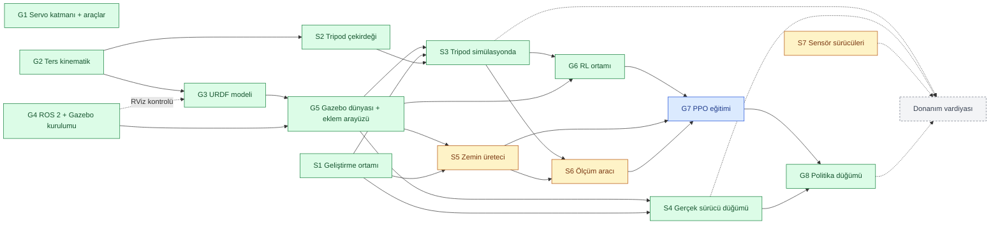
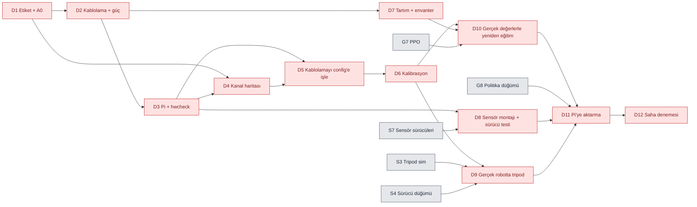

# Görev Dağılımı

İş iki bölüm:

1. **Yazılım aşaması — ŞİMDİ.** Görkem ve Samet'e bölüşüldü. Her şey CAD geometrisiyle simülasyonda ilerler; robota dokunulmaz.
2. **Donanım vardiyası — ⏸ DURDURULDU.** Kablolama, kalibrasyon, tartım ve gerçek robotta denemeler. Yazılım aşaması belli bir noktaya gelince ayrı bir vardiya olarak topluca yapılır (başlama şartı [aşağıda](#donanım-vardiyası--durduruldu)).

Proje bağlamı: [docs/PROJE_DEVIR.md](docs/PROJE_DEVIR.md). Kurulum ve araçlar: [README.md](README.md).

> [!NOTE]
> 2026-09-24'te yeniden düzenlendi. İlk dağılımdaki (commit `a2348a7`) numaralar geçersiz: o planda Samet donanıma ayrılmıştı, artık yazılım görevleri alıyor.

## Nasıl okunur

- **Kimlik:** `G` Görkem'in, `S` Samet'in yazılım görevleri; `D` donanım vardiyası. Örnek: `S3` Samet'in 3. görevi. Commit mesajlarında ve konuşurken bu kimlikler kullanılır.
- **Bekler:** başlamadan önce bitmiş olması gereken görevler. Bunlar bitmeden başlanırsa iş ya yapılamaz ya da tekrar yapılır.
- **Açar:** bu görev bitince başlayabilecek görevler.
- **Bitti sayılır:** görevin kapanma şartı. Şart sağlanmadan ✅ konmaz.
- **Durum:** ✅ bitti · 🔄 sürüyor · ⬜ başlayabilir · ⏸ bekliyor (bir bağımlılık bitmedi ya da durduruldu)

Bir görevi bitiren kişi durumunu ✅ yapar ve "Açar" satırındaki görevlerin sahiplerine haber verir.

---

## Yazılım aşaması (şimdi)

### Bağımlılık grafiği

Mavi Görkem'in, sarı Samet'in, yeşil bitmiş görevler. Oklar "önce bu biter, sonra şu başlar" demek. Gri kesikli kutu durdurulmuş donanım vardiyası.

### Özet

| Kimlik | Görev | Sahip | Bekler | Açar | Durum |
|---|---|---|---|---|---|
| G1 | Servo sürücü katmanı, kalibrasyon ve kanal haritası araçları | Görkem | — | (vardiya) | ✅ |
| G2 | Ters/düz kinematik + gövde pozu | Görkem | — | G3, S2 | ✅ |
| G3 | URDF modeli | Görkem | G2 (son kontrol: G4) | G5 | ✅ |
| G4 | ROS 2 Lyrical + Gazebo kurulumu (Görkem'in PC'si) | Görkem | — | G3, G5 | ✅ |
| G5 | Gazebo dünyası + eklem komut arayüzü + sanal sensörler | Görkem | G3, G4 | S3, S4, S5, G6 | ✅ |
| G6 | RL ortamı (Gymnasium) | Görkem | G5 ✅, S3 ✅ | G7 | ✅ |
| G7 | PPO eğitimi + alan rastgeleleştirme | Görkem | G6 ✅, S5, S6 | G8 | 🔄 |
| G8 | Politika çalıştırma düğümü (ROS 2) | Görkem | G7, S4 ✅ | (vardiya) | ✅ |
| S1 | Geliştirme ortamı (ROS 2 + Gazebo, depo, testler) | Samet | — | S3, S4, S5 | ✅ |
| S2 | Tripod yürüyüş çekirdeği (saf Python) | Samet | G2 ✅ | S3 | ✅ |
| S3 | Tripod yürüyüş simülasyonda | Samet | S1 ✅, S2 ✅, G5 ✅ | G6, S6, (vardiya) | ✅ |
| S4 | Gerçek robot sürücü düğümü (ROS 2, dry-run) | Samet | S1 ✅, G5 ✅ | G8, (vardiya) | ✅ |
| S5 | Zemin / dünya üreteci | Samet | S1, G5 | G7, S6 | ⏸ |
| S6 | Yürüyüş ölçüm aracı (hız, enerji, devrilme) | Samet | S3, S5 | G7 | ⏸ |
| S7 | Sensör sürücüleri (saf Python, dry-run testli) | Samet | — | (vardiya) | ⬜ |

**Şu an başlanabilecekler:**
- **Görkem:** G6 bitti (2026-09-26; tripod RL ortamında ölçüldü). G7 düz zeminde sürüyor: ödül v4 + taklit ile başlatma; alan rastgeleleştirmenin S5'e bağlı olmayan kısmı (servo gücü, gecikme, itme) yapılabilir. Zeminli eğitim ve "bitti" ölçümü S5 + S6'yı bekler.
- **Samet:** S1, S2, S3, S4 bitti (2026-09-25). Sıradaki: S5 (zemin üreteci) ya da S7 (sensör sürücüleri) — ikisi de kimseyi beklemiyor. S6 (ölçüm aracı) yalnızca S5'i bekliyor.
- Derleme: `bash tools/wsl/derle.sh`. Yeni paket eklendiğinde (ör. S4'ün ROS düğümü) tekrar çalıştırılmalı.
- **Samet için (2026-09-26):** ROS'lu sim artık varsayılan olarak tork servo modelinde (`servo:=torque`; eskisi `servo:=velocity`). Tripod'un orada ölçülen hızı %84'ten %98'e çıktı (0.08 komutta 0.079 m/s); S2/S3 notlarındaki "ROS'lu simde ayaklar kayar" uyarısı artık eski modele ait. Günlükteki "out of limits" uyarıları eklem hız sınırında torkun kesilmesinden (beklenen). Ayrıntı: docs/ARAYUZ.md madde 4.

**İki kişinin birbirini beklediği yerler:**
1. **G5 → S3, S4, S5:** Samet'in simülasyon işleri Görkem'in Gazebo dünyasını ve eklem komut arayüzünü bekler. Samet o sırada S2 (tripod çekirdeği) ve S7 (sensör sürücüleri) ile meşgul olur, boşta kalmaz.
2. **S3 → G6:** RL ortamı, tripod yürüyüşü hem karşılaştırma ölçütü hem de RL'in üstüne öğreneceği temel olarak kullanır.
3. **S5 + S6 → G7:** PPO eğitimi, Samet'in ürettiği zeminlerde yapılır ve Samet'in ölçüm aracıyla değerlendirilir.
4. **S4 → G8:** politika düğümü, gerçek sürücüyle aynı arayüzü konuşmalı ki simülasyondan robota geçişte kod değişmesin.

### Görkem'in görevleri

#### G1 — Servo sürücü katmanı ve araçlar ✅
`hexapod_driver` paketi; `calibrate.py`, `map_channels.py`, `hwcheck.py`, `cad_extract.py`.

#### G2 — Ters kinematik ✅
`hexapod_kinematics`: tek bacak IK/FK, altı bacak, gövde pozu. IK ↔ kalibrasyon sözleşmesi [CLAUDE.md](CLAUDE.md)'de.

#### G3 — URDF modeli ✅
- **Bekler:** G2; son kontrol (RViz, `check_urdf`) için G4 · **Açar:** G5
- Bitenler:
  - CAD'den kütle/atalet/çarpışma verisi (`tools/cad_sim_model.py`, `robot.yaml` → `simulation`).
  - URDF üreticisi (`hexapod_description.urdf`, `python tools/make_urdf.py`); görsel mesh'ler `meshes.yaml`'dan.
  - Test: URDF zincirindeki ayak konumları IK ile 300 rastgele pozda aynı; eksen yönleri kalibrasyon sözleşmesiyle uyumlu (`tests/test_urdf.py`).
  - ROS'suz önizleme (`python tools/preview_urdf.py`): parçalar eklemlerde doğru oturuyor.
  - `check_urdf` hatasız; robot_state_publisher'ın TF'i IK ile aynı (bacak 0 ayağı (0, 0.230, −0.137) m, bacak 2 (0.199, −0.115, −0.137) m).
  - RViz: `ros2 launch hexapod_description display.launch.py` hatasız açılıyor, mesh'ler yükleniyor. WSLg'de RViz Wayland'de çöküyordu ("Invalid parentWindowHandle"); launch dosyası Wayland varsa `QT_QPA_PLATFORM=xcb` veriyor.
- **Bitti sayılır:** RViz'de robot doğru görünüyor, eklem kaydırıcıları bacakları doğru yönde oynatıyor; `check_urdf` hatasız.

#### G4 — ROS 2 + Gazebo kurulumu ✅
- **Bekler:** — · **Açar:** G3, G5
- WSL2 Ubuntu 26.04'e ROS 2 Lyrical + Gazebo. Hepsini tek betik yapar: WSL terminalinde depo klasöründen `bash tools/wsl/ros_kurulum.sh`. `sudo` şifresini betik bir kez sorar, Görkem kendisi girer.
- **Bitti sayılır:** betik "KURULUM TAMAM" diyor; `gz sim shapes.sdf` pencere açıyor.
- Sonuç: ROS 2 Lyrical, Gazebo 10.5 (Jetty), Python 3.14. Paketler `bash tools/wsl/derle.sh` ile `~/hexapod_ws`'te derleniyor.

#### G5 — Gazebo dünyası + eklem komut arayüzü ✅
- **Bekler:** G3, G4 · **Açar:** S3, S4, S5, G6
- Bitenler (ROS'suz yazılabilen her şey, 15 test):
  - Arayüz: `hexapod_description.interface` + [docs/ARAYUZ.md](docs/ARAYUZ.md). `/leg_controller/commands` (Float64MultiArray, 18 değer, radyan), `/joint_states`, `/imu`, `/leg{i}/foot_contact` (yalnız sim).
  - URDF'e Gazebo ekleri: ros2_control (konum komutu), gz_ros2_control eklentisi (kazanç servo tepki süresinden), IMU ve altı ayak temas sensörü.
  - Kontrolcü ayarı üretici (`hexapod_description.control`; ForwardCommandController).
  - `hexapod_gazebo` paketi: `worlds/flat.sdf`, `launch/sim.launch.py`, `ros2 run hexapod_gazebo stand` (ayağa kalkma duruşu).
- Gazebo'da doğrulandı (`sim.launch.py gui:=false`):
  - İki kontrolcü açık; bütün konular (/imu, /joint_states, 6 temas, komut) yayında.
  - Doğunca sıfır duruşunda gövde 0.1366 m (= tibia + 10.05 mm, ayaklar yerde).
  - `ros2 run hexapod_gazebo stand` sonrası gövde 0.1001 m (istenen 100 mm), yatıklık yok.
  - IMU `imu_link` çerçevesinde, z ivmesi 9.8. Temas sensörleri SDF'teki ayak küresine bağlı.
  - Konum limiti (±90°) ve hız limiti (7.48 rad/s) ros2_control tarafından uygulanıyor.
  - Gazebo penceresi WSLg'de açılıyor.
- Robot düz zeminde doğar; 18 eklem pozisyon kontrollü (`gz_ros2_control`); IMU ve ayak temas sensörleri ROS 2 konularına yayınlanır.
- **Eklem komut arayüzünü bu görev tanımlar:** hangi konu, hangi mesaj, hangi sıra, hangi birim. Samet'in tripod'u (S3), gerçek sürücüsü (S4) ve Görkem'in politika düğümü (G8) aynı arayüzü konuşur; simülasyondan robota geçişte yalnızca karşı taraf değişir. Arayüz bir belge olarak yazılır ve Samet'le birlikte gözden geçirilir.
- **Bitti sayılır:** tek komutla robot simülasyonda doğup duruyor; eklemler arayüzden komut alıyor; IMU ve temas verisi `ros2 topic echo` ile görülüyor; arayüz belgesi depoda.

#### G6 — RL ortamı ✅
- **Bekler:** G5 ✅, S3 ✅ · **Açar:** G7
- Bitenler: `hexapod_rl.sim.HexapodSim` — ROS'suz, süreç içi Gazebo (gz.sim). Aynı URDF, aynı fizik, ros2_control ile aynı servo modeli. Tek süreç 2 ms adımda gerçek zamanın 4.5 katı, 8 paralel süreç toplam ~21 katı (50 Hz'de 1 milyon adım ~16 dk). Testli (Linux'ta 6 Gazebo testi: ayakta duruş, 100 mm'ye kalkış, sıfırlama, aynı komut = aynı sonuç, limit kırpma).
- Bitenler (2): `hexapod_rl.env.HexapodEnv` (Gymnasium) — gözlem yalnız gerçek robotta da olanlar (IMU, son komutlar, hız komutu, adım saati), eylem ayakta duruş + düzeltme, ödül TÜBİTAK tanımına göre (`hexapod_rl.task`). SB3'ün `check_env` denetiminden geçiyor. `python -m hexapod_rl.train` ile 8 paralel ortamda PPO: ~500 adım/s (gerçek zamanın ~10 katı). Kurulum: `bash tools/wsl/rl_kurulum.sh` (venv; torch CPU, SB3, Gymnasium).
- **Tripod aynı ortamda ölçüldü (2026-09-26, "bitti" şartı):** `hexapod_rl.baseline.TripodPolicy` Samet'in `TripodGait`'ini SB3 modeliyle aynı arayüzle sarar; `python -m hexapod_rl.evaluate tripod --vx 0.1 [--noise 0.1]`. Ödül v4, düz zemin, 10 s: 0.05/0.10/0.15 m/s komutunda gerçek hız 0.049/0.098/0.146 m/s, yön sapması <0.4°, adım başı ödül 2.83/3.20/3.60, mekanik güç 1.5/1.9/2.6 W. Eyleme 0.1 gürültü eklenince 0.044/0.067/0.098 m/s, ödül 1.88/1.99/2.11 (açık döngü; titreşimde hız kaybediyor). Karşılaştırma tablosu: [models/README.md](models/README.md).
- Tripod'a dayanan eylem modu (S3'ün üstüne düzeltme) yapılmadı; yerine politika tripod benzeri bir gösterimle taklit yoluyla başlatılıyor (G7).
- **Önemli düzeltme (2026-09-25):** RL simülasyonunun servo modeli tork tabanlı oldu. Eski (hız komutlu) modelde elle yazılmış tripod bile beklenen hızın %12'siyle yürüyordu; yeni modelde aynı katalog torkunda %94–97. **Samet için (S2/S3): tripod'unu `hexapod_rl.sim` ile de dene; ROS'lu simülasyon (sim.launch.py) hâlâ eski servo modelini kullanıyor, orada ayaklar kayar.**
- **Hız ölçümü (G5 sonrası), tasarımı belirliyor:** tam simülasyon (ROS + ros2_control + sensörler + köprü) sınırsız modda bile gerçek zamanın ~1.3 katı; 50 Hz'de 1 milyon adım ~4 saat. ROS'suz yalın Gazebo ~3–5 kat. `gz.sim` Python bağları kurulu (Python 3.14). Öneri: eğitim ortamı ROS'u aradan çıkarıp Gazebo'yu süreç içinden adımlasın, 8 çekirdekte paralel ortam; ROS arayüzü (docs/ARAYUZ.md) yalnız politika düğümünde (G8) kalır. Başka simülatöre geçmek TÜBİTAK başvurusundan sapma olur, önerilmiyor.
- Gymnasium ortamı, ros_gz üzerinden. Gözlem: IMU + eklem açıları + ayak temasları. Eylem: eklem hedefleri ya da tripod parametre düzeltmeleri (S3'ün üstüne). Ödül: ileri hız − enerji − devrilme cezası (TÜBİTAK başvurusundaki tanım).
- **Bitti sayılır:** rastgele politikayla bir bölüm uçtan uca koşuyor; tripod'un ödülü aynı ortamda ölçülüp kaydedildi.

#### G7 — PPO eğitimi 🔄
- **İlk deneme (G6 duman testi, 2026-09-24):** 1M adım, 8 ortam, 34 dk. Ödül ~550'den ~810'a çıktı ama değerlendirmede robot yerinde durdu (vx 0.1 m/s istendi, 10 s'de -1.5 cm), devrilmedi. Yorum: ödül yerinde durmayı fazla ödüllendiriyor; sıfırdan yürümek için 1M az. Sıradaki: ödül düzeltmesi + uzun eğitim; S3 gelince tripod'un üstüne öğrenme.
- **İlk yürüyen politika (2026-09-25):** tork tabanlı servo modeli + ödül v2, 10M adım, 8.1 saat. Kararlı yürüyor (~0.087 m/s), 10M adım boyunca hiç devrilmedi. Ama hız komutunu yok sayıyor (0.05/0.10/0.15 m/s'de aynı hız) ve saniyede ~12° sağa dönüyor. Model ve tablo: [models/](models/README.md). Sıradaki: ödül v3 (dönüş izleme ve hız izleme güçlenecek).
- **Ödül v3 başarısız, v4 + taklit ile başlatma (2026-09-25/26):** v3 (dönüş izleme ağırlığı 1.0, dar tolerans) ile ilk yürüyen politikadan 2.5M adım devam: dönme hiç düzelmedi. Sebep: v3'ün izleme terimleri anlık gövde hızına bakıyordu; PPO'nun keşif gürültüsünde gövde sallandığı için bu terimler, eğitim sırasında dönen politikayı düz yürüyüşten daha çok ödüllendiriyordu (0.98'e 0.63). v4: izleme terimleri gövde hızının 0.5 s'lik ortalamasına bakıyor. Politika önce simetrik bir gösterim tripod'unu taklit ederek başlatılıyor (`hexapod_rl.pretrain`); bu başlangıç hız komutunu %95–100 izliyor, yön sapması <3°.
- **PPO v4 (taklitten, 4M adım; 5M planlıydı, bilgisayar kapatılınca durdu):** eylem gürültüsü altında tripod'u açık farkla geçiyor (0.10 m/s: 0.108'e 0.067 m/s, ödül 2.64'e 1.99). Gürültüsüz düz zeminde ise tripod biraz önde (ödül 3.11'e 3.20) ve politika 3–4 kat enerji harcıyor; 0.15 m/s'de yön sapması −33°. Sıradaki: ödül v5 (enerji cezası güçlü, hedef hızı aşma teşviki yok) + S5'e bağlı olmayan alan rastgeleleştirme. Tablo: [models/README.md](models/README.md).
- **Gece deneyleri (2026-09-26):** ödül v5 (enerji −0.05/W, progress süzülmüş hıza) + alan rastgeleleştirme (servo gücü/sertliği, 0–18 ms gecikme, itme, IMU gürültüsü). v5_dr (taklitten, 5M): rastgeleleştirmede hiç devrilmiyor ama gürültüsüz koşuda yön kayıyor (−24..−42°) ve enerji yüksek. gSDE (düzgün keşif) iki denemede de bozuldu, bırakıldı. Ödül v6 (dönüş toleransı 0.1) + düşük gürültüyle devam (v7, +3M): **`models/ppo_v7_8M`** hız komutunu doğru izliyor (0.053/0.098/0.146), yön sapması dörtte bire indi, eylem gürültüsü altında en iyisi. Ama düz zeminde tripod hâlâ önde (ödül 2.94'e 3.22; enerji 3 katı). Güç cezasını iki katına çıkarıp 2M adım daha (v8): enerji değişmedi (6.4 W; tripod 1.9 W); terim terim bakınca tripod'la fark neredeyse tamamen enerji, ilerlemede PPO önde. Tablo: [models/README.md](models/README.md). **Artık eylem (tripod + düzeltme, `--residual`):** `models/ppo_res_250k` enerji sorununu çözdü (tripod'dan ~%20 fazla, v7'de 3 kat); gürültüsüz ödülde 0.10 ve 0.15 m/s'de tripod'u geçiyor, rastgeleleştirmede neredeyse eşit, eklem gürültüsünde önde. Uzun eğitimde yine hedef hızı aşmaya kayıyor (en iyi 250k). **G7 için önerilen yol bu.** Sıradaki: zeminler (S5) ve ölçüm (S6) ile tripod'u zorlu zeminde geçmek ("bitti" şartı); gerçek temas (ayak teması şu an geometrik).
- **Dayanıklılık taraması (2026-09-27):** robota geçişte beklenen ama eğitimde olmayan hatalar simde sabit olarak eklenip modeller ölçüldü (`python -m hexapod_rl.robustness`, `task.Perturbation`): kalibrasyon ofseti, eğik IMU, uzun gecikme, zayıf servo. **IMU 20°'ye kadar eğik takılı olsa da, komut 240 ms gecikse de sonuç neredeyse aynı.** Hassas olunanlar: kalibrasyon (eklem başına σ4°'de düzde %7–12 kayıp, tripod da aynı; 35 mm'lik model basamakta σ1°'de bile 0.80 → 0.62 m) ve servo torku (×0.5'te zemin modelleri basamakta yarıya iniyor, 50 mm'lik ×0.4'te düzde devriliyor). Donanım vardiyasına not D6 ve D9 satırlarında. Tablolar: [models/README.md](models/README.md), PROJE_DEVIR ders 37.
- **Öğrenilmiş ayak kaldırma (2026-09-27 gece): `models/ppo_kaldirma35_250k` (orta yol).** Politika taban tripod'un ayak kaldırmasını 19. çıkışla (20–60 mm) kendisi seçiyor (`train --lift-range`, `hexapod_rl.widen`; her salınımın başında seçilir). Amaç düzde az, engelde çok kaldırmaktı; **kör politika bunu yapmadı**: kaldırma her zeminde aynı, eğitim zemin karışımı için tek bir değere ayarlanıyor (25 mm'den başlayınca ~28 mm'de kalıyor, 35 mm'den başlayınca 53 mm'ye çıkıyor; PROJE_DEVIR ders 35–36). Zemine göre seçim için engeli görmek gerekir (mesafe sensörü, S7); çıkış ve düğüm tarafı hazır. Yan ürün: v21'in 250k ara kaydı (~35 mm) düzde 2.39 W (`ppo_omni_250k` 2.00, `ppo_lift50_3750k` 3.99), 45 mm basamak / 60 mm engebe / 10° kaygan yokuş 3/3, engel skoru 0.496 (0.338 / 0.763); ROS'lu simde gerçek düğümle 45 mm basamak ve çukurdan çıkıyor, 60 mm basamakta takılıyor. Tablolar: [models/README.md](models/README.md).
- **Zeminde en iyisi (2026-09-26 akşamüstü): `models/ppo_lift50_3750k`** (ppo_lift50_2250k'dan std 0.05 ile devam): 60 mm basamak ve 60 mm çukur da 3/3, zemin skoru 0.957 (tripod 0.404, 50 mm adımlı tripod 0.548). Düzde hedef hızı %14 aşıyor, 4.0 W; ödülle (aşma cezası) düzeltme denendi, enerji azalmadı ve zemin bozuldu: kör politikada düz verim ile zemin sağlamlığı ödünleşimi (PROJE_DEVIR ders 33). Çözüm ileri bakan mesafe sensörleri (S7) olabilir. **Bütün zemin türlerinde** (eğim, engebe, kaygan, basamak; kendi deneme zeminlerim) engel skoru 0.763, Samet'in tripod'u 0.281 (50 mm adımla 0.443); tripod 15° kaygan yokuşta kayıp devriliyor, politika tutunuyor. **Samet için (S5):** kaygan yokuşta fiziksel sınır μ > tan θ; 15° μ 0.3 gibi %10'luk paylı durumlar kimse tarafından çıkılamıyor, müfredatta payı geniş (ör. 10° μ 0.25) başlanmalı. Engebe için blok zemin örneği `terrain_probe.rough`.
- **İlk zeminli eğitim (2026-09-26 öğleden sonra): `models/ppo_lift50_2250k`.** Ortam başına zemin altyapısı hazır (`train.py --terrains`; S5 gelince yalnız liste değişir). Kendi deneme zeminlerimde (çukur, yayla, eğim): taban tripod ayağı 25 mm kaldırırken RL 2.25M adımda hiçbir engeli öğrenemedi; tabanı 50 mm yapınca 45 mm basamak/çukur, 50 mm yayladan iniş ve 60 mm çukurdan geri çıkış 3/3 geçildi (rastgeleleştirme açık). Samet'in tripod'u (25 mm adım) bunların hiçbirini geçemiyor; **50 mm adımla da** (`GaitParams.step_height_mm`, `terrain_probe tripod:50`) zemin skoru 0.548'de kalıyor, RL 0.879 (aynı 50 mm tabana göre RL'nin katkısı engellerde +%15). Bedeli düz zemin: hedef hızı %10 aşıyor, 3.8 W (düzde `ppo_omni_250k` daha iyi).
- **Her yöne politika (2026-09-26 öğlen): `models/ppo_omni_250k`.** İleri/geri, yana ve dönüş komutlarının hepsiyle eğitildi (`--omni`); robottaki düğüm geri/yana/dönüşte yürüyor, sıfıra yakın komutta ayakta bekliyor (ölü bölge). Yedi komutluk sette ödül 2.868 (tripod 2.848); eklem gürültüsünde 1.84'e 1.46. **Düz zeminde tripod'u anlamlı geçmiyor** (±%1; std 0.15'le uzun eğitimde deterministik davranış bozuluyor, std 0.05'le iyileşme yok). Kendi deneme zeminlerimde (`terrain_probe`, S5'in yerine geçmez) 20° yokuş ve 30 mm basamakta tripod'dan %6–21 hızlı; **45 mm basamağı ne tripod ne politika çıkabiliyor** (ayak 25 mm kalkıyor): zeminli eğitimin ilk hedefi. Ayrıca: en iyi ara kayıt otomatik seçiliyor (`best_model.zip`), gövde kütlesi ×0.9–1.6 rastgeleleştiriliyor. Tablolar: [models/README.md](models/README.md).
- **Zemine göre ayak teması (2026-09-26, yeni PC):** RL simine `terrain_height(x, y)` eklendi; temas, gövde yüksekliği ve devrilme zemine göre. Fizik temas sensörü denendi: tek süreçte 381 → 182 adım/s ve mesajlar eşzamansız; bırakıldı, doğrulama aracı olarak kullanıldı (0–20° eğimde %97.8–98.8 uyum). Düz zeminde sonuçlar birebir aynı. Yeni PC'de 16 ortamla eğitim 1818 adım/s (eski PC'nin 2.7 katı).
- **Bekler:** G6 ✅, S5 (zeminler), S6 (ölçüm) · **Açar:** G8
- Stable-Baselines3 PPO. Alan rastgeleleştirme: zemin, sürtünme, kütle, itme, gecikme. Eğitim şimdilik geçici eklem limitleri (±90°) ve CAD'den 2,13 kg kütle tahminiyle yapılır; gerçek değerlerle yeniden eğitim donanım vardiyasında (D10).
- **Bitti sayılır:** politika S6'nın ölçümünde tripod'u geçiyor; eğim, engebe ve kaygan zeminde ayrı ayrı ölçüldü.

#### G8 — Politika çalıştırma düğümü ✅
- **Bekler:** G7 (son politika), S4 ✅ · **Açar:** donanım vardiyası (D11)
- **Yapıldı (2026-09-26):** yeni paket `hexapod_policy` (Samet'in teleop/hardware deseni: `controller.py` ROS'suz çekirdek, `node.py` ince kabuk). `ros2 run hexapod_policy policy --ros-args -p policy:=models/<ad>/policy.npz`. `/imu` + `/cmd_vel` → `/leg_controller/commands`, 50 Hz.
  - **Torch'suz:** politika `python -m hexapod_rl.export models/<ad>/model.zip` ile `.npz`'ye aktarılır (aktör ağı + eğitim sözleşmesi: eylem ölçeği, varsayılan duruş, adım saati, komut hızı, eğitimdeki komut aralıkları). Aktarım, SB3'ün çıktısıyla karşılaştırılarak doğrulanır (fark < 1e-5). Pi'de yalnız numpy gerekir.
  - **Gözlem eğitimdekiyle birebir:** test, düğümün gözlemini `hexapod_rl.task.observation` ile karşılaştırır (eğik/dönük gövde, ilerlemiş saat).
  - **Güvenlik:** komut yok / zaman aşımı (0.5 s), ileri hız eğitim aralığının yarısının altında (dur; geri, yana, yerinde dönüş eğitilmedi), IMU yok / bayat (0.2 s), gövde 45°'den fazla yatık → politika koşmaz, ayakta duruş yayınlanır, adım saati sıfırlanır. Aralık dışı komut aralığa kırpılır ve uyarı yazılır.
  - **Doğrulama:** (1) kapalı döngü, süreç içi Gazebo (tork modeli): taklit_bc_v4 politikası düğüm çekirdeğiyle 4 s'de >0.28 m, yön <5° (test). (2) Gerçek süreç olarak düğüm (ROS): komutsuz ayakta duruş, IMU + /cmd_vel ile yürüyüş, SIGTERM'de çıkış 0, politika dosyası yoksa çıkış 2 (test). (3) **ROS'lu Gazebo'da canlı** (`sim.launch.py` + düğüm, vx 0.1; hız gz poz yayınından, sim zamanıyla, hareketin orta %80'inde): tork servo modeliyle 0.096 m/s (%96), yön −0.3°, yükseklik 98 mm; eski hız modeliyle 0.083 m/s (%83). Komut kesilince "komut zaman aşımı". (İlk ölçümde "~0.071 m/s" yazılmıştı; o yöntem pencereye boşta geçen süreyi katıyordu, yanlıştı.)
  - **Çıkarım süresi:** PC'de (i5-10300H, eğitim sürerken) tick başına 44 µs, yalnız MLP 18 µs. Pi 4 bundan ~5–10 kat yavaş varsayılsa bile <0.5 ms; 20 ms'lik bütçenin çok altında (tahmin; D11'de ölçülecek).
  - **Her yön politikasıyla tekrar (2026-09-26):** `models/ppo_omni_250k/policy.npz` ROS'lu simde (tork modeli) gerçek düğümle: ileri %101, geri %100, yana %101–104, dönüş %99–100, karışık komut %96–104, gövde 98 mm; sıfır komutta ölü bölge, hareket 0.0 mm. Araç: `bash tools/wsl/politika_ros_olcum.sh [policy.npz]`.
  - **Zeminde (2026-09-26):** `ppo_lift50_3750k` ROS'lu simde deneme zemini dünyalarında (`terrain_probe.world_sdf`) 45 mm basamakta 1.14 m, 60 mm basamakta 0.96 m, 45 mm çukurdan geri 1.17 m (12 s); `ppo_omni_250k` üçünde takılıyor.
  - **Öğrenilmiş ayak kaldırma (2026-09-27):** sözleşmede `lift_range` varsa ağın 19. çıkışı kaldırmaya çevrilir, eğitimdeki gibi salınım başında seçilir. `ppo_kaldirma35_250k` ROS'lu simde düzde her komutta %100–107, 45 mm basamak ve 45 mm çukurdan geri/yana çıkıyor.
  - Kalan: S5'in zeminleriyle aynı araçla tekrar; IMU montaj dönüşü (S7/D8) sürücüde uygulanacak, düğüm `/imu`'yu `base_link` yöneliminde bekler (docs/ARAYUZ.md).
- Eğitilmiş politikayı ROS 2 düğümü olarak çalıştırır: sensörleri okur, eklem komutu yayınlar. Önce simülasyonda; Pi 4'te gerçek zamanlı çalışabilecek kadar hafif (CPU, ONNX ya da düz PyTorch; ölçülür).
- **Bitti sayılır:** simülasyonda politika bu düğümle yürüyor; çıkarım süresi Pi 4 için tahmin edildi.

### Samet'in görevleri

#### S1 — Geliştirme ortamı ✅
- **Bekler:** — · **Açar:** S3, S4, S5
- Depoyu klonla; `python -m pytest -q` ile 73 testin geçtiğini gör. ROS 2 + Gazebo: Windows'ta WSL2 + Ubuntu 26.04 kur, sonra `bash tools/wsl/ros_kurulum.sh` (Görkem'in kullandığı betiğin aynısı). Linux'ta aynı betik doğrudan çalışır.
- Kuruldu (2026-09-25): WSL2 Ubuntu 26.04, ROS 2 Lyrical + Gazebo 10.5 (`ros_kurulum.sh`), 6 paket derlendi (`derle.sh`), RL ortamı (`rl_kurulum.sh`: torch 2.14 CPU, SB3 2.9.0, gymnasium 1.3.0). `python -m pytest -q`: 124 test geçiyor (gz.sim testleri dahil, 0 atlanan).
- **Bitti sayılır:** testler geçiyor; betik "KURULUM TAMAM" diyor. ✅

#### S2 — Tripod yürüyüş çekirdeği (saf Python) ✅
- **Bekler:** G2 ✅ · **Açar:** S3
- Yeni paket `hexapod_gait`, `hexapod_driver`/`hexapod_kinematics` gibi ROS'suz çekirdek. Tripod adım döngüsü (iki üçlü grup), destek ve salınım fazında ayak yörüngeleri, hedef gövde hızından (ileri, yan, dönüş) ayak hedeflerine, oradan `HexapodKinematics.inverse` ile eklem açılarına. Hız, adım yüksekliği, adım süresi, duruş genişliği parametre.
- Dikkat: IK erişilemeyen hedefte `ReachError` fırlatır, kırpmaz; yörünge erişim alanında kalmalı.
- Yöntem: her bacak için bir dünya-çerçevesi "çapa" (anchor) tutulur. Ayak yere basınca çapa kilitlenir ve destek boyunca hiç değişmez (gövde üstünden geçer); kalkınca, salınım bitince gövdenin (komut edilen hızla) nerede olacağı tahmin edilip oraya düz gidilir, yükseklik sinüs kavisiyle. Olay tabanlı olduğu için komut hızı bölüm içinde değişse bile (RL'nin üstüne binmesi, G6) her destek fazı kendi içinde tutarlı kalıyor.
- Testli (`tests/test_tripod_gait.py`, 9 test): komşu bacaklar hep farklı grupta; düz/yana/dönerek yürürken `ReachError` yok (0.15 m/s'e kadar denendi); destek fazındaki ayak (düz ve dönerken) dünyada sabit (<1 µm sapma); bir döngüde ayak izi mesafesi komut hızıyla %5 içinde uyuşuyor; her an tam 3 ayak yerde; komut sıfırsa ayaklar yatayda kıpırdamıyor; `reset()` nötr duruşa dönüyor.
- **Gerçek fizikte doğrulandı (`tests/test_tripod_gait_physics.py`, Görkem'in G6 notundaki isteği üzerine):** `hexapod_rl.sim` (gz.sim, tork tabanlı servo modeli) üzerinde 0.05–0.15 m/s aralığında komutun **%97–98'i** gerçek hız, yanal kayma 6 saniyede <0.5 cm, yükseklik 98–99 mm (hedef 100). Görkem'in elle yazdığı açık döngü yörüngeden (%94–97) biraz daha iyi. ROS'lu simülasyon (`sim.launch.py`) hâlâ eski hız-komutlu servo modelinde olduğu için orada ayaklar kayabilir (bilinen açık iş, PROJE_DEVIR §13.1b); S3 gerçek robota/ROS'a bağlarken bunu göz önünde bulundur.
- **Bitti sayılır:** ROS'suz testler geçiyor: bütün yörünge boyunca her ayak erişim alanında; destek fazındaki ayaklar dünyada sabit; bir döngüde gövde hedef mesafeyi alıyor; her an en az üç ayak yerde. ✅

#### S3 — Tripod yürüyüş simülasyonda ✅
- **Bekler:** S1 ✅, S2 ✅, G5 ✅ · **Açar:** G6, S6, donanım vardiyası (D9)
- Yeni paket `hexapod_teleop`. S2'yi G5'in eklem komut arayüzüne bağlayan ROS 2 düğümü; `/cmd_vel` (`geometry_msgs/Twist`) dinler, `TripodGait` ile eklem açısı üretip `/leg_controller/commands`'a yayınlar.
- Mantık iki katmana ayrıldı (hexapod_rl'deki env.py/task.py ayrımıyla aynı desen): `controller.py` ROS'suz çekirdek (hız sınırlama, zaman aşımı/deadman, `ReachError` yakalama — testli, 8 test), `node.py` ince rclpy kabuğu.
- Güvenlik: komut S2'de test edilen aralığa kırpılıyor (vx ±0.15, vy ±0.08, wz ±0.5 m/s|rad/s). 0.5 sn `/cmd_vel` gelmezse otomatik sıfır hıza döner (deadman) — komut veren taraf çökerse robot sonsuza kadar yürümez.
- Not (S2'den): ROS'lu simülasyon (`sim.launch.py`) hâlâ eski hız-komutlu servo modelinde, orada tripod'un ayakları kayabilir (bkz. S2 notu, PROJE_DEVIR §13.1b). `hexapod_rl.sim` ile (tork modeli) test edilirse %97-98 hız doğruluğu ölçüldü.
- S4 sırasında eklendi: SIGTERM'de temiz kapanış düzeltmesi (bkz. S4 notu) ve düğüm için otomatik süreç testi (`tests/test_ros_nodes.py`).
- **Gazebo'da canlı doğrulandı** (`sim.launch.py gui:=false` + `ros2 run hexapod_teleop teleop`, 2026-09-25):
  - İleri, 65 sn, vx=0.08 m/s: 0→4.38 m, dümdüz (65 sn'de 4.8 mm yana kayma), yükseklik hep 0.097-0.100 m — **devrilme yok**. Gerçek hız ~0.068 m/s (komutun %85'i — eski servo modeli yüzünden `hexapod_rl.sim`'deki %97-98'den düşük, beklenen).
  - Yana, 10 sn, vy=0.06 m/s: 0.48 m yana gitti (%79), ileri yönde sürüklenme yok (0.1 mm).
  - Yerinde dönüş, 10 sn, wz=0.4 rad/s: konum ~sabit (<1 mm), ~161° döndü (komutun %70'i).
- **Bitti sayılır:** Gazebo'da düz zeminde devrilmeden en az 1 dakika ileri yürüyor; yana ve yerinde dönüş çalışıyor. ✅

#### S4 — Gerçek robot sürücü düğümü ✅
- **Bekler:** S1 ✅, G5 ✅ (arayüz) · **Açar:** G8, donanım vardiyası (D9)
- `hexapod_driver`'ın ROS 2 sarmalayıcısı: G5'teki eklem komut arayüzünü dinler, `ServoBus`'a taşır, eklem durumunu yayınlar. Çekirdek saf Python kalır (CLAUDE.md'deki ayrım). Robot olmadan `--dry-run` ile yazılır ve test edilir.
- Yeni paket `hexapod_hardware`: `controller.py` ROS'suz çekirdek (`DriverController`, testli), `node.py` ince rclpy kabuğu. Çalıştırma: `ros2 run hexapod_hardware driver --ros-args -p dry_run:=true` (gerçek donanımda `dry_run` verilmez).
- `hexapod_driver`'a küçük ekleme: `ServoBus.pulse_for_angle()` ve `set_angles()`. 18 eklemin hepsi önce doğrulanır (kalibrasyon, eklem limiti, mutlak darbe sınırı, kart/kanal tanımı); biri reddedilirse **hiçbir servoya darbe gitmez**. Yarım uygulanmış komut bir bacağı sıçratırdı. `set_angle` davranışı değişmedi (mevcut 30 test aynen geçiyor).
- Davranış: bozuk komut (yanlış uzunluk, NaN) ve limit dışı komut servoya gitmez, uyarı basılır, düğüm çalışmaya devam eder. `/joint_states` son **kabul edilen** komuttur (MG996R geri bildirim vermez); ilk komuttan önce yayınlanmaz, konum uydurulmaz. Düğüm kapanırken bütün servolar serbest bırakılır (tork kesilir, robot çöker; bilerek).
- Kablolama/kalibrasyon eksikse düğüm başlamaz, eksik alanları listeler (`calibrate.py` gibi). Gerçek `robot.yaml`'da şu an kablolama boş, yani gerçek config ile dry-run bile **bilerek** hata verir; denemek için `-p config:=... -p calibration:=...` ile sahte kablolamalı dosya verilir.
- Testli (`tests/test_driver_controller.py` 9 test + `test_servo_layer.py`'de 3 yeni `set_angles` testi): 18 eklemin her biri doğru karta, doğru kanala, doğru darbeyi yazıyor (her eklem farklı merkez/yön/katsayı, iki kart); bozuk/limit dışı/kalibrasyonsuz komutta backend'e **hiçbir yazma** gitmiyor; `stop()` iki kartta da tüm kanalları kapatıyor; **S3'ün ürettiği tripod komutu** (gerçek `TeleopController` çıktısı, ~4 sn) sürücüde de 199/199 kabul ediliyor, yani simülasyonla aynı komut arayüzü.
- ROS'lu canlı doğrulama (WSL, dry-run, sahte kablolama, 2026-09-25): gerçek config'te temiz hata ve çıkış kodu 2; geçerli komut `/joint_states`'e yansıdı; bozuk komut uyarıyla reddedildi, durum bozulmadı; **S3 + S4 birlikte** (`/cmd_vel` → teleop → komut → sürücü) yürüyüş açıları `/joint_states`'te değişerek akıyor, sürücü hiç komut reddetmedi. Canlı deneme, birim testlerinin göremediği bir hatayı yakaladı (aşağıda).
- Bulunan hatalar (ikisi de canlı denemede çıktı, birim testleri göremezdi; PROJE_DEVIR §12.19): (1) bu ROS sürümünde `rclpy` günlükçüsünde `warn` yok, adı `warning`; ilk sürümde düğüm **ilk reddedilen komutta çöküyordu**. (2) SIGTERM/arka plan Ctrl+C'de `spin` `KeyboardInterrupt` değil `ExternalShutdownException`/`RCLError` fırlatıyor: hata izi + çıkış kodu 1 (servolar yine bırakılıyordu, `finally` çalışıyor). İkisi de düzeltildi; (2) S3'ün `hexapod_teleop` düğümünde de aynıydı, orada da düzeltildi.
- Düğüm kabukları için otomatik test (`tests/test_ros_nodes.py`, 3 test, yalnız rclpy'li ortamda; Windows'ta atlanır): düğümler `python -m` ile gerçek süreç olarak başlatılıp konulardan sürülüyor. Sürücü: bozuk ve limit dışı komutta çökmüyor, durum bozulmuyor, geçerli komut `/joint_states`'e yansıyor, eksik kablolamada `drivers[1].address`'i söyleyip çıkış kodu 2 ile çıkıyor. Teleop: `/cmd_vel` → 18 değerlik komut. İkisi de SIGTERM'de çıkış kodu 0, hata izi yok. **Bu testlerin iki hatayı yakaladığı, hatalar geri konarak doğrulandı.**
- Ölçüm notu: `/joint_states` yayın hızı `ros2 topic hz` ile ortalama 38.8 Hz çıktı (düğümün zamanlayıcısı 50 Hz). Ölçüm WSL'de üç düğüm çalışırken CLI ile yapıldı; hız kaybının araçtan mı makineden mi düğümden mi geldiği ayrıştırılmadı. Pi'de I2C yazma süresi de ayrıca ölçülmeli (18 blok yazma ~13 ms tahmin, 20 ms'lik bütçeye yakın): donanım vardiyasında D9'da bakılacak.
- **Bitti sayılır:** dry-run'da 18 eklem doğru kanala doğru darbeyi yazıyor (test); simülasyonla aynı komut arayüzü. ✅

#### S5 — Zemin / dünya üreteci ⏸
- **Bekler:** S1, G5 · **Açar:** G7, S6
- RL eğitimi ve ölçüm için Gazebo dünyaları: eğim (açı ayarlı), engebe (yükseklik haritası, pürüzlülük ayarlı), basamak, kaygan zemin (sürtünme ayarlı). Parametreyle ve rastgele tohumla üretilebilir olmalı; aynı tohum aynı dünyayı verir.
- **Bitti sayılır:** her zemin türü parametreyle üretiliyor ve robot o dünyada doğuyor; birkaç örnek dünyanın görüntüsü depoda.
- **Görkem'den entegrasyon notu (2026-09-26):** RL eğitimi ROS'lu simi değil süreç içi Gazebo'yu (`hexapod_rl.sim.HexapodSim`) kullanıyor. Zemin oraya `HexapodSim(model, terrain_sdf=...)` ile girer: düz zeminin (`_FLAT_GROUND`) yerine geçen, `<model>...</model>` biçiminde, `<static>true</static>` bir SDF parçası (dünya dosyasının tamamı değil). Böylece üreteç iki simde de kullanılabilir: ROS'lu sim için aynı parçayı bir dünya dosyasına gömmek yeterli. Sürtünme zeminin `<collision><surface><friction>`'ında; "kaygan zemin" ve G7'nin sürtünme rastgeleleştirmesi buradan gelir. Sürtünme ölçüldü: düz zeminde mu 1.0–0.15 arası yürüyüşü etkilemiyor, 0.05'te %8 yavaşlatıyor; kaygan zemin ancak eğimle anlamlı.
- **Güncelleme (2026-09-26, G7): her zemin SDF'iyle birlikte yüzey yüksekliğini de vermeli.** `HexapodSim/HexapodEnv/evaluate(..., terrain_sdf=..., terrain_height=h)`; `h(x, y)` dünya (x, y)'deki üst yüzeyin z'si, metre. İkisi birlikte zorunlu (yalnız biri → `ValueError`). Ayak teması, gövde yüksekliği cezası ve devrilme artık buna göre ölçülüyor; fizik motorunun temas sensörü denendi, eğitimi yarı yarıya yavaşlattığı için bırakıldı (PROJE_DEVIR §12.26). Yükseklik temasıyla sensör 0–20° eğimde %98 uyuşuyor.
  - Robot orijinde, ayaklarının altındaki zemine göre doğuyor: **orijinin z=0'da olması artık gerekmiyor.**
  - Önerilen arayüz: `terrain.slope(deg, seed) -> (sdf, height)`, `terrain.rough(height_m, seed) -> (sdf, height)`...; `height` saf Python bir fonksiyon (ya da `__call__`'lı nesne), gz'siz test edilebilir. Yükseklik haritalı zeminde `height` aynı ızgaradan (bilineer) okunmalı ki fizikteki yüzeyle aynı olsun.
  - Örnek (eğimli kutu, üst yüzü orijinden geçer): `tests/test_rl_env.py` içindeki `_box_ground`.

#### S6 — Yürüyüş ölçüm aracı ⏸
- **Bekler:** S3, S5 · **Açar:** G7
- Bir yürüyüş denetleyicisini (tripod ya da RL politikası) seçilen zeminlerde N kez koşturup ölçen betik: ileri hız, enerji (Σ |tork × açısal hız|), devrilme sayısı, düşmeden gidilen mesafe. Sonuçlar bir tabloya.
- **Bitti sayılır:** tripod'un her zemindeki ölçümü tablo olarak depoda; RL için aynı komutla çalışıyor.
- **Görkem'den not (2026-09-26):** ölçümün çekirdeği hazır, üstüne kurulabilir: `hexapod_rl.evaluate.evaluate(model, seconds, vx, seed, noise, task)` hız, yön sapması, adım başı ödül, ortalama mekanik güç (W, Σ|τ·ω|), devrilme, ritim uyumu veriyor; `model` bir SB3 modeli ya da `hexapod_rl.baseline.TripodPolicy()` (senin tripod'un, aynı arayüzle). Eksik olan: zemin seçimi (S5'in `terrain_sdf`'i `HexapodEnv`'e geçirilmeli), N tekrar ve tablo. Politikayı ROS'suz koşturduğu için hızlı (~10x gerçek zaman).

#### S7 — Sensör sürücüleri (saf Python) ⬜
- **Bekler:** — · **Açar:** donanım vardiyası (D8, D11)
- `hexapod_driver` ile aynı desende, donanımsız test edilebilir: VL53L0X'leri XSHUT ile sırayla uyandırıp yeniden adresleme (üçü de 0x29'da doğar; BNO055 de 0x29'da olabilir, çakışmaya dikkat), BNO055'ten yönelim ve ivme okuma. `DryRunBackend` ile testler. Gerçek donanımda denemesi vardiyada.
- **Bitti sayılır:** veri sayfalarına göre yazmaç düzeyinde testler robotsuz geçiyor.

---

## Donanım vardiyası (⏸ durduruldu)

Donanım işleri şimdilik yapılmıyor. Yazılım aşaması gerçek robotta denenecek bir şey üretince ayrı bir vardiya olarak topluca yapılır.

- **Önerilen başlama şartı:** S3 (tripod simülasyonda yürüyor) ve S4 (gerçek sürücü düğümü) bitmiş olsun. D1–D8 yazılımı beklemez; ekip isterse vardiyayı daha erken de açabilir.
- **Sahipler vardiya başlarken atanır.** Robotu kuran kişi montaj, kablolama ve kalibrasyonu yapar. Görkem robotu kurmadığı için ona D5 ve D10 gibi yazılım tarafındaki işler düşer.
- **Güvenlik:** [docs/PROJE_DEVIR.md](docs/PROJE_DEVIR.md) §4.4. Özellikle: PCA9685'in VCC'si Pi'nin **3.3 V**'una (pin 1), 5 V'a değil. Servolar voltaj düşürücüden **~6 V** ile beslenir (dolu 2S LiPo 8.4 V verir, MG996R en fazla 7.2 V kaldırır).

| Kimlik | Görev | Bekler | Bitti sayılır |
|---|---|---|---|
| D1 | "ÖN" bandı + bacak numaraları; bir PCA9685'in A0 lehimi | — | Bantlar yapıştırıldı (yukarıdan saat yönünde 1–6: 1 sol ön, 2 sağ ön, 3 sağ orta, 4 sağ arka, 5 sol arka, 6 sol orta; hangi tarafın ön olduğu fark etmez). Bir kartın A0'ı lehimli (0x40 → 0x41). Fotoğraf paylaşıldı. |
| D2 | Kablolama ve güç hattı | D1 | PCA9685 → Pi: VCC→pin 1 (3.3 V), SDA→3, SCL→5, GND→6. Servolar kartlara (sıra fark etmez). Buck çıkışı **bağlamadan önce** multimetreyle ~6 V'a ayarlanıp ölçüldü. Pi ayrı beslemede, topraklar ortak, sigortanın yeri not edildi. |
| D3 | Pi kurulumu + `hwcheck.py` | D2 | Ubuntu Server 26.04 arm64, depo klonlu, I2C açık (`/dev/i2c-1`, kullanıcı `i2c` grubunda). `python3 tools/hwcheck.py` iki PCA9685'i (0x40, 0x41) ve IMU'yu görüyor. |
| D4 | Kanal haritası (`map_channels.py`) | D1, D3 | Robot kutu üstünde, bacaklar havada. 18 eklemin tamamı eşlendi (`1c` = bacak 1 coxa, `3f` femur, `6t` tibia); harita paylaşıldı. |
| D5 | Kablolamayı `robot.yaml`'a işle | D3, D4 | Bant numaraları robot.yaml bacak kimliklerine çevrildi (PROJE_DEVIR §5.5), `drivers[*].address` ve `joints[*].driver/channel` dolu; `calibrate.py --dry-run` eksik bildirmiyor. |
| D6 | 18 eklemin kalibrasyonu (`calibrate.py`) | D5 | Her eklem: `c` → `dir` → `span` → `limit min/max`. `config/calibration.yaml` dolu ve commit'li; `limits` çıktısı robot.yaml'a işlendi (URDF artık gerçek limitleri kullanır). **Doğruluk hedefi eklem başına ~2°:** simde σ2°'lik rastgele ofset düzde ≤%4 kaybettiriyor, σ4° %7–12; 35 mm'lik modelin basamak becerisi σ1°'de bile düşüyor (G7 dayanıklılık taraması, PROJE_DEVIR ders 37). |
| D7 | Tartım ve elektronik envanteri | D2 | Robot yürüyeceği hâliyle tartıldı → `body.total_mass_kg`, `measured: true`. Üstündeki batarya/buck sayısı, kapak takılı mı yazıldı; `simulation.mass_inputs` düzeltilip `tools/cad_sim_model.py` yeniden çalıştırıldı. |
| D8 | Sensör montaj bilgisi + S7'nin donanım testi | D3, S7 | IMU adresi ve montaj yönü, üç VL53L0X'in XSHUT GPIO'ları ve bakış yönleri robot.yaml → `sensors`'ta. Üç mesafe sensörü ve IMU aynı anda okunuyor. |
| D9 | Gerçek robotta tripod | D6, S3, S4 | Önce havada, sonra yerde yürüyor. Simülasyondan farklar raporlandı: ayak sapması, servo ısınması, besleme çökmesi (Pi resetlenirse brownout'tur, yazılım hatası değil). Ayrıca aşağıdaki "S4'ten devredilen, robotta doğrulanacaklar" listesi tamamlandı. **Servo beslemesinin yük altındaki gerilimi ölçülmeli:** simde durma torku katalog değerinin (1.08 N·m @6 V) yarısının altına inince zemin modelleri engelde, 50 mm'lik model ×0.4'te düzde de devriliyor; 25 mm'likler ×0.4'te yürüyor. Robotta ilk politika denemesi 25 mm'lik modelle (`ppo_omni_250k`). |
| D10 | Gerçek limit ve kütleyle yeniden eğitim | D6, D7, G7 | G7 gerçek eklem limitleri ve ölçülen kütleyle tekrarlandı; D9'daki farklar rastgeleleştirme aralıklarına yansıtıldı. |
| D11 | Pi 4'e aktarma | D10, G8, D8, D9 | Politika + ROS 2 düğümleri Pi'de, gerçek IMU ve servolarla kapalı döngü; robot düz zeminde yürüyor. |
| D12 | Saha denemesi | D11 | TÜBİTAK planındaki gerçek arazi denemesi: eğim, engebe, kum, kaygan zemin. Her zemin için video, hız ve devrilme sayısı. |

### S4'ten devredilen, robotta doğrulanacaklar (D9 ile birlikte yapılır)

S4 (sürücü düğümü) yalnızca dry-run'da ve simülasyonla doğrulandı. Aşağıdakiler robot olmadan **görülemedi**, D9'da sırayla kontrol edilecek. Unutulmasın diye burada:

1. **Gerçek I2C yolu hiç çalıştırılmadı.** Geliştirme PC'sinde `smbus2` kurulu değil, `SMBusBackend` denenmedi. Pi'de `pip install smbus2`, sonra `ros2 run hexapod_hardware driver` (`dry_run` **verilmeden**). Önce kablolama girilince (D5/D6) dry-run'ın eksik alan vermeden başladığını gör, sonra gerçek donanım. 18 eklemin her birinin doğru servoyu sürdüğünü gözle doğrula (D4 haritasıyla karşılaştır).
2. **I2C yazma süresi ölçülmedi.** 18 eklem = 18 blok yazma; 100 kHz I2C'de ~13 ms **tahmin** (ölçüm değil), 50 Hz komut bütçesi 20 ms. Pi'de ölç. Sığmazsa: değişmeyen kanallara yazmayı atla ya da I2C hızını 400 kHz'e çıkar.
3. **`/joint_states` hızı.** WSL'de `ros2 topic hz` ile ortalama 38.8 Hz ölçüldü (düğümün zamanlayıcısı 50 Hz); sebebi (ölçüm aracı / WSL yükü / düğüm) ayrıştırılmadı. Pi'de tekrar ölç.
4. **İlk komutta 18 servo aynı anda beslenir.** MG996R konum geri bildirimi vermez; ilk komutta bulundukları yerden hedefe tam hızla gider, akım sıçrar ve brownout riski doğar (Pi resetlenirse yazılım hatası gibi görünür, bkz. brif §6). İlk denemeyi robot havada, güç kaynağı akım sınırlıyken yap. Gerekirse kademeli açılış (bacak bacak) sürücüye eklenir. Bu bir **risk tespiti**; denenmedi.
5. **Sert çökmede servolar bırakılamaz.** Düğüm `SIGTERM`/Ctrl+C ile kapanırken servolar serbest kalır (test edildi). `kill -9` ya da elektrik kesilmesinde PCA9685 son darbeyi üretmeye devam eder, servolar tork uygular; yazılımla çözülemez. Servo hattına acil kesme (anahtar/röle) düşünülmeli.
6. **Kalibrasyon bilgisi olmadan komut reddedilir.** Bu bilerek böyle (`MissingValue`); D6 bitmeden sürücü hiçbir servoyu sürmez. D9'da `calibration.yaml` dolu ve commit'li olmalı.
